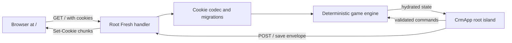

# CRM Simulator Technical Design

## 1. Architecture summary

CRM Simulator is a stateless Fresh application with one application route and
one interactive root island. The server owns cookie serialization, validation,
migration, and offline catch-up. The client owns the live workspace, user
commands, display ticking, and debounced saves. A shared pure engine owns all
game rules.



There is no authentication, database, API route, feature route, service worker,
or alternate browser storage.

## 2. Route invariant

`routes/index.tsx` is the only application route.

### `GET /`

1. Read save metadata and chunk cookies.
2. Verify the HMAC before decoding untrusted state.
3. Decode, decompress, parse, validate, and migrate the save.
4. Apply bounded offline catch-up through the shared engine.
5. Stop offline catch-up at a crisis boundary if required.
6. Render the CRM shell and hydrate the root island with state and load status.
7. Refresh migrated or offline-advanced cookies on the response when required.

If no save exists, the handler creates a new deterministic company state. If a
save is corrupt, it preserves enough information for recovery messaging and
renders a safe recovery state rather than silently replacing the cookie.

### `POST /`

A discriminated action envelope selects one operation:

- `save`: validate a complete client snapshot, enforce revision rules, and write
  cookies;
- `reset`: clear all known save chunks and return a fresh company state;
- `export`: validate and return a portable JSON download;
- `import`: validate and migrate a portable JSON save before replacing cookies.

Schema version 6 adds bounded quote records independently from deals. Quote
acceptance applies its commercial terms to the deal, then uses the canonical
deal-win transaction to create the customer, subscription MRR, and onboarding
work without duplicating revenue state transitions.

Schema versions 9 and 10 add customer lifecycle fields and a bounded customer
success roster. Health, adoption, renewals, expansion, ownership, payroll, and
playbook outcomes remain canonical simulation state; older customers migrate as
active accounts so an upgrade cannot create surprise churn.

Schema version 11 adds bounded support tickets with channel, priority,
ownership, lifecycle timestamps, response and resolution deadlines, and one-time
SLA breach tracking.

Schema version 12 separates support ownership into a bounded specialist roster
and adds escalation, incident records, workload burnout, and resolution quality.

Schema version 17 persists the 1x/2x/4x simulation scale. Existing saves migrate
to the faster 2x default and repair ticket-resolution counts that older builds
incorrectly incremented during assignment.

Schema version 18 adds persistent campaign-chapter progress, pending narrative
briefings, and the campaign completion timestamp. Chapter requirements remain
derived from canonical CRM, workforce, customer-health, support, and automation
state; the narrative record stores only irreversible campaign progress and
whether the current briefing has been acknowledged.

Schema version 19 removes unused simulated data-ops fields: integrations, custom
fields, saved views, and duplicate-review counters. Existing saves drop those
platform records during migration.

Each operation returns JSON except export. The client identifies the action in
the request body, not in a query path. Requests must use
`Content-Type: application/json` except a bounded multipart import if later
required.

The handler checks same-origin request metadata for state-changing actions.
Responses containing game state use `Cache-Control: no-store`.

### Asset exception

Fresh-generated JavaScript, CSS, source maps, icons, fonts, and static media may
use normal Fresh/static URLs. They carry no application state. No other URL may
expose a page, game action, persistence action, or data response.

## 3. Proposed source layout

```text
routes/
  index.tsx                    # Sole GET/POST application route
islands/
  CrmApp.tsx                   # Sole interactive application root
  gameStore.ts                 # Client command, clock, and save controller
components/
  shell/                       # Navigation, top bar, workspace, dialogs
  views/                       # Progressive CRM workspaces
  records/                     # Tables, fields, timelines, shared record UI
lib/
  game/
    types.ts                   # Domain and save contracts
    state.ts                   # Initial state and invariants
    actions.ts                 # Commands and pure reducers
    simulation.ts              # Fixed-interval real-time simulation
    rng.ts                     # Seeded deterministic random source
    catalog.ts                 # Generated names and balancing data
  persistence/
    schema.ts                  # Runtime validation and save versions
    codec.ts                   # Compact JSON, gzip, base64url
    cookies.ts                 # Chunk manifest, signing, cookie headers
    migrations.ts              # Sequential schema migrations
```

Views are plain components rendered by `CrmApp`; they are not route islands.
Additional islands should not be introduced unless a measured hydration boundary
justifies them without weakening the single-store invariant.

## 4. State model

### 4.1 Save envelope

The persisted envelope contains:

- schema version;
- game content/balance version;
- company seed;
- save revision;
- creation, save, and last-simulated timestamps;
- simulation clock and crisis/bankruptcy state;
- normalized CRM records;
- economy and staff state;
- unlocked capabilities;
- aggregate history;
- bounded recent activities and notifications;
- onboarding progress and UI preferences.

Company identity, accessibility preferences, and simulation speed are canonical
save data. They change through validated commands and use the same cookie
autosave path as simulation progress.

The save does not persist values that can be reliably derived from canonical
records. Display labels, generated descriptions, computed KPIs, filtered lists,
chart series, and navigation state should be derived.

### 4.2 Normalized records

Contacts, companies, deals, customers, campaigns, tasks, tickets, employees, and
automation rules use compact stable IDs and normalized maps or bounded arrays.
Relationships store IDs rather than duplicated objects.

Campaigns accrue their daily budget in the same fixed simulation intervals as
operating expenses. Channel-specific boundaries generate deterministic leads,
and each lead stores its originating campaign ID for reporting. Offline campaign
spend uses the normal Crisis Pause boundary.

Campaign edits require a paused record, duplicates begin paused with clean
performance totals, and archival removes records from active workflows without
breaking historical attribution. Funnel and channel reports derive from
campaign, lead, deal, and customer relationships rather than persisted totals.
After the detailed campaign limit is reached, the oldest archived records are
folded into aggregate count, spend, and lead totals; stale campaign references
are removed from retained leads during the same immutable transition.

Pipeline unlock evaluation runs after accepted canonical commands and requires
$1,000 current MRR plus three open deals. Deal product, value, expected close,
and closed-lost reason changes are canonical commands. Schema v4 assigns a
product tier to pre-v4 deals from their persisted monthly value.

Schema v5 adds bounded sales-representative records and optional deal ownership.
Hiring and assignment are canonical commands. Representative salary joins
baseline expenses in each fixed simulation step, while skill and open-deal
utilization adjust the probability gain when an assigned deal advances. Lead
ownership uses the same representative IDs. Territory routing is a pure,
capacity-aware command that assigns each active unowned lead to the least-loaded
eligible representative; no queue totals are persisted.

Hiring, assignment, routing, deal edits, and outcomes all use the shared typed
activity projection. The recent timeline remains capped at 100 records and
increments immutable archived-activity history as older sales detail rolls off.

Enums serialize as small numeric or compact string codes. Timestamps serialize
as integer game minutes or epoch seconds where appropriate. Human-readable field
names remain in TypeScript types and conversion functions, not repeated
throughout persisted JSON.

### 4.3 State invariants

Every reducer and loaded save must preserve:

- unique IDs and monotonic sequence counters;
- references to existing records or explicit tombstones;
- finite bounded numbers;
- valid lifecycle transitions;
- nonnegative capacity allocation;
- one active company state;
- unlock prerequisites consistent with canonical progress;
- bounded activity, notification, and chart history;
- a simulation timestamp no later than the accepted wall clock.

Runtime validation rejects unknown discriminants, impossible ranges, malformed
IDs, excessive collection sizes, and prototype-bearing data.

## 5. Deterministic engine

The engine is pure TypeScript. It must not import Preact, Fresh, cookies, DOM
APIs, or call the wall clock directly.

```ts
advance(state, elapsedGameMinutes, rules): AdvanceResult
applyCommand(state, command, rules): CommandResult
```

Callers supply elapsed time and rules. Results include the next immutable state,
domain events, summaries, and any crisis or bankruptcy transition.

### 5.1 Fixed intervals

Simulation advances in fixed game-time intervals. Large elapsed periods may be
processed in bounded batches, but advancing 60 minutes at once must produce the
same canonical result as advancing six 10-minute segments.

Event variation comes from a seeded PRNG whose cursor is persisted. Randomness
is deterministic and cannot depend on collection iteration order or render
timing.

### 5.2 Domain events

Commands and simulation emit typed events such as:

- lead created, qualified, cooled, or converted;
- outreach completed or response received;
- deal advanced, won, or lost;
- subscription charged, renewed, expanded, or churned;
- expense accrued;
- task created, completed, or overdue;
- unlock earned;
- crisis entered or bankruptcy declared.

Events update activity feeds, notifications, aggregate history, and offline
summaries through bounded projectors. The event log is not retained forever.

### 5.3 Offline catch-up

`GET /` computes accepted elapsed real time as:

```text
max(0, min(now - lastSimulatedAt, 24 hours))
```

It converts accepted real time at one game hour per real minute at 1x,
multiplies the result by the saved 1x/2x/4x scale, and advances through the
normal engine. Before applying an interval that would bankrupt the company,
offline mode stops at the previous valid state and emits Crisis Pause.

Active mode does not use this protection. It emits bankruptcy, freezes
simulation, and requires a reset action.

Clock skew is clamped and recorded as a load warning. Time beyond the cap is
discarded by advancing the real-world checkpoint to the accepted load time, not
stored as debt.

## 6. Client application

### 6.1 Root island

`CrmApp` receives the server-authoritative hydrated state. It owns:

- active workspace and record selection;
- modal and panel state;
- command dispatch;
- live clock presentation;
- autosave lifecycle and status;
- offline, crisis, corruption, and bankruptcy dialogs;
- responsive CRM shell.

Application navigation uses component state. It must not call
`history.pushState` to invent feature URLs.

### 6.2 Client store

The store wraps a Preact signal and exposes typed selectors and command
dispatch. UI components never mutate nested game state directly.

A one-second display timer calculates elapsed time from timestamps. The engine
advances at deliberate intervals and whenever a command needs a current state.
Background-tab throttling therefore cannot change outcomes.

### 6.3 Saving

Meaningful state mutations schedule a debounced `POST /` save. Saves carry the
current revision and a client request ID. The server rejects stale revisions and
returns its accepted revision and timestamp.

The client:

- displays Saved, Saving, or Save failed;
- retries transient failures with bounded backoff;
- does not claim success until the response arrives;
- attempts a final save on visibility loss or page lifecycle events where the
  platform permits;
- keeps unsaved state in memory only;
- never falls back to another persistence API.

Closing a page before a request completes may lose the most recent unsaved
action. Frequent debouncing and lifecycle flushing reduce, but cannot eliminate,
that browser limitation.

## 7. Cookie persistence

### 7.1 Encoding pipeline

```text
validated save
  -> compact persisted representation
  -> JSON UTF-8 bytes
  -> gzip
  -> base64url
  -> fixed-size chunks
  -> HMAC-SHA-256 signature and manifest
```

Gzip uses the runtime's native compression streams. The codec must round-trip
Unicode fictional names even though source files default to ASCII.

### 7.2 Cookie set

A namespaced metadata cookie records format version, chunk count, encoded byte
count, revision, and signature. Numbered cookies hold payload chunks. Names are
stable and scoped to `/`.

Conservative limits:

- payload per chunk leaves room below common 4096-byte cookie limits;
- maximum chunk count is explicitly bounded;
- total encoded save budget is tested against a representative mature fixture;
- stale higher-numbered chunks are expired after a smaller save;
- failed encoding or budget checks leave the prior valid cookies untouched.

### 7.3 Signing and trust

The server signs the encoded payload using HMAC-SHA-256 and `COOKIE_SECRET`.
Production startup must require a stable secret. Development may use a clearly
logged local fallback so saves survive restarts only when the same fallback
remains configured.

Signing detects accidental corruption and direct cookie modification. It is not
an anti-cheat boundary because the browser submits game state to save. The
server still performs strict schema, invariant, size, and revision validation.

### 7.4 Flags

Game cookies use:

- `HttpOnly` so application JavaScript cannot read raw saves;
- `SameSite=Strict`;
- `Path=/`;
- a long bounded `Max-Age`;
- `Secure` in production HTTPS environments.

The root handler sets and clears all chunks. The island never writes
`document.cookie`.

### 7.5 Migration and recovery

Migrations are sequential pure functions from one schema version to the next.
The loader validates the outer envelope, migrates, then validates the current
schema and invariants.

On failure, the UI offers:

- retry load;
- download the raw encoded save for support/recovery;
- import a known-good export;
- reset and start a new company.

Reset requires confirmation and expires every namespaced cookie.

## 8. Import and export

Export posts the current revision to `/`. The server returns a human-readable,
versioned JSON document suitable for download. It contains the portable game
state and metadata but no HMAC or server secret.

Import posts a size-bounded document to `/`. The server parses with defensive
limits, validates or migrates it, assigns a new save revision, writes signed
cookies, and returns the hydrated result.

Import and export are explicit user actions. The application never reads an
export file automatically.

## 9. UI architecture

The interface uses an original CRM design system with compact operational
density:

- persistent desktop sidebar and responsive mobile navigation;
- compact top bar with search/command entry, status, and company controls;
- unframed full-width workspaces;
- stable tables, filters, panels, dialogs, and forms;
- visible locked modules with milestone requirements;
- familiar icons from an established package when added;
- restrained transitions and reduced-motion support.

Shared record components encapsulate table behavior, field display/editing,
timelines, status controls, filters, and empty states. Business rules remain in
engine commands rather than view components.

## 10. Security and privacy

- No personal data is requested; all CRM records are fictional.
- No external analytics or telemetry is required.
- State-bearing responses are not cached.
- State-changing requests enforce same-origin expectations and strict content
  types.
- Import size, object depth, collection counts, strings, and numeric ranges are
  bounded.
- Rendered generated content is treated as text, never injected HTML.
- Cookie secrets are environment variables and never exposed to the client.
- HTTPS is required in production for Secure cookies.

## 11. Testing strategy

### Unit tests

- deterministic PRNG and generated records;
- command lifecycle transitions and invariants;
- interval equivalence and deterministic replay;
- revenue, expenses, workload, churn, unlocks, and bankruptcy;
- seven-game-day inactive cap and crisis stop;
- schema validation and every migration;
- codec round trips, tampering, corruption, chunk cleanup, and size fixtures.

### Route tests

- new and returning `GET /` behavior;
- each accepted `POST /` action;
- stale revision, malformed body, origin, and content-type rejection;
- cookie flags and expired stale chunks;
- corrupt-save recovery;
- absence of other application/API route files.

### Browser tests

- first lead-to-customer journey;
- autosave and hard-refresh restoration;
- offline summary and Crisis Pause;
- active bankruptcy and restart;
- export/import/reset;
- module unlock navigation;
- desktop and mobile layout, keyboard use, and reduced motion;
- network inspection confirming `/` as the only app/data request path.

## 12. Operational configuration

Required production environment:

```text
COOKIE_SECRET=<stable high-entropy secret>
```

The application also honors Fresh's standard `PORT` configuration. It does not
require Supabase or auth variables.

Deployment templates are project-neutral. `deploy/install.sh` renders a named
systemd service and optional HTTP or HTTPS nginx proxy from an explicit
production command. It does not install runtimes, dependencies, nginx, or TLS
certificates, and `--dry-run` renders configuration without root access.

## 13. Explicit exclusions

The architecture must not add:

- authentication or real role enforcement;
- Supabase or another database;
- localStorage, sessionStorage, or IndexedDB;
- service-worker game persistence;
- API or feature routes;
- cloud synchronization or multiplayer;
- real integrations or third-party tracking.
